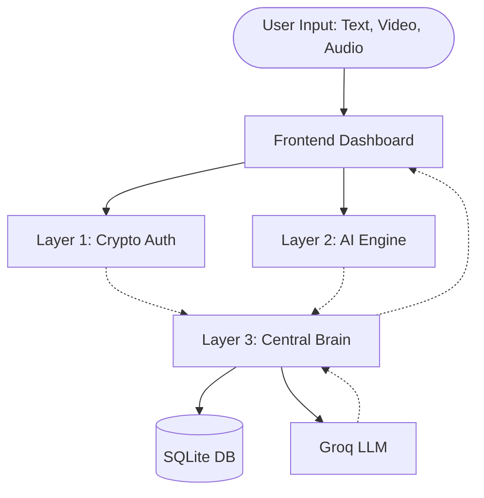
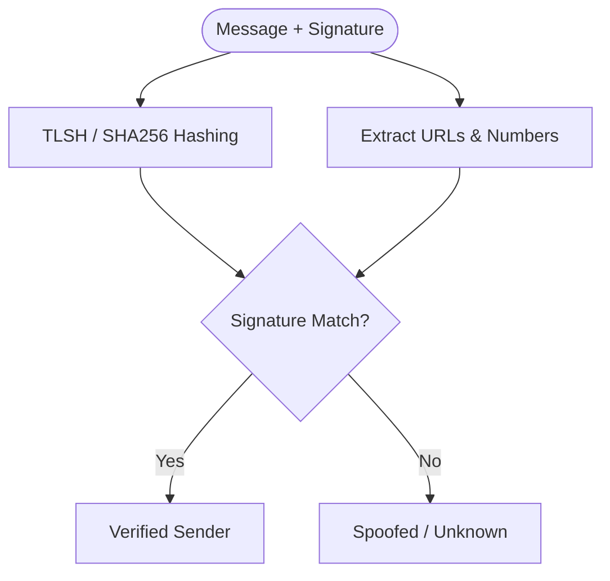
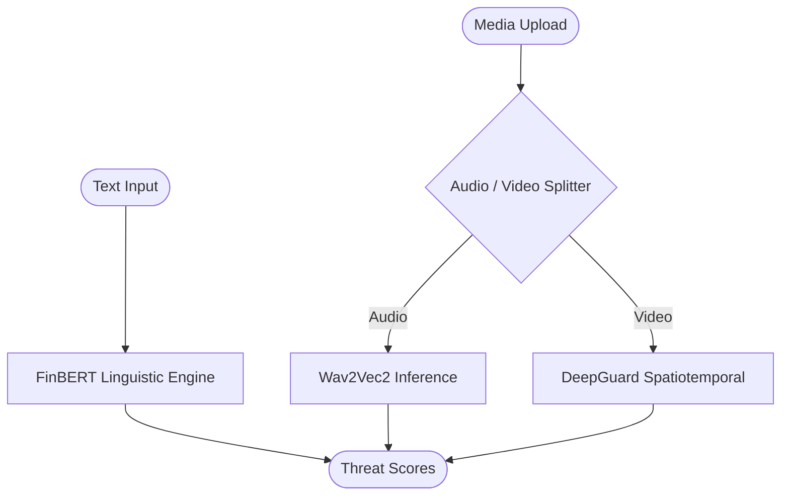
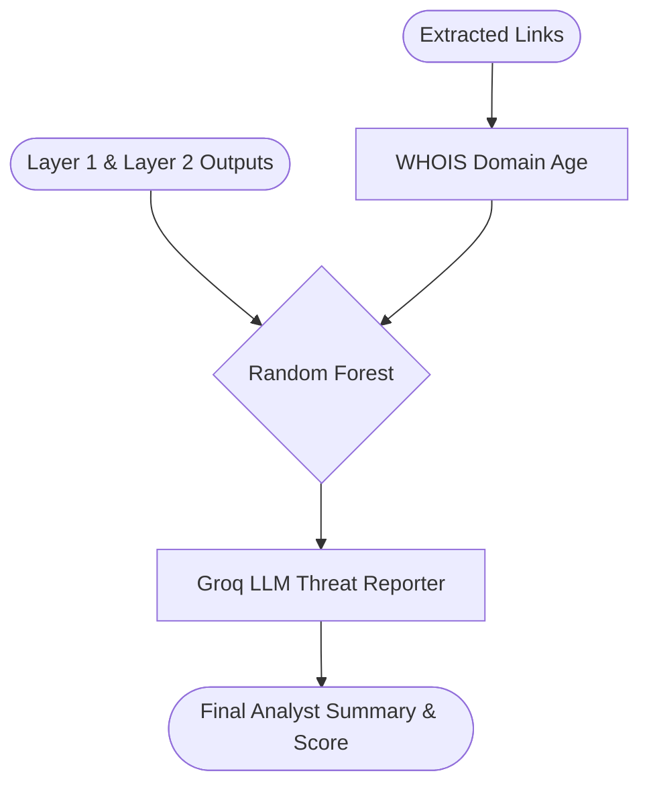

# PRISM: Zero-Trust AI Threat Detection System

PRISM is a state-of-the-art, multi-layered threat detection platform designed to protect users from sophisticated financial scams, phishing attacks, and AI-generated deepfakes (Audio/Video).

By combining **Zero-Trust Cryptographic Authentication** with **Multi-Modal AI Inference** and a **Random Forest Central Brain**, PRISM can mathematically prove the authenticity of official communications while simultaneously flagging high-risk social engineering attacks.

---

## 🏗️ System Architecture



PRISM is built on a highly decoupled Microservices Architecture to ensure that CPU-intensive machine learning workloads do not block cryptographic verification or the frontend dashboard.

### 1. Frontend Dashboard (React + Vite + TailwindCSS)
A dynamic, real-time analytics dashboard that provides a unified view of the threat landscape.
- **Visualizes Threat Scores:** Displays real-time gauges for Text Phishing, Audio Deepfakes, Video Deepfakes, and an Overall Threat Score.
- **Analyst Summaries:** Renders human-readable, AI-generated LLM reports explaining exactly *why* an asset was flagged.
- **Threat Probability Timelines:** Plots threat confidence over time for audio and video media.

### 2. Layer 1: Zero-Trust Cryptography (FastAPI)



The first line of defense. Handles cryptographic signature verification using robust hashing (`TLSH` and `SHA256`) and Ed25519 digital signatures.
- **Fuzzy Hashing (TLSH):** Calculates fuzzy hashes of text to ensure that minor forwarding noise (like extra spaces or lost emojis on WhatsApp) doesn't break the signature.
- **Critical Token Extraction:** Strictly parses out URLs and account numbers to prevent typosquatting (e.g., `sebl.gov.in` instead of `sebi.gov.in`).
- **Cryptographic Provenance:** Proves whether a message genuinely came from a verified financial institution (like SEBI or a registered bank).

### 3. Layer 2: Multi-Modal AI Engine (FastAPI)



The heavy-lifting machine learning layer that analyzes the content of the message across all modalities.
- **FinBERT (Text):** A specialized NLP model trained on financial vocabulary to detect high-urgency phishing scripts and OTP-stealing social engineering.
- **Wav2Vec2 (Audio):** Analyzes vocal patterns to detect AI-generated synthetic voices (Vishing / Voice Phishing).
- **DeepGuard (Video):** Analyzes spatiotemporal artifacts to detect face-swaps and visual deepfakes.

### 4. Layer 3: Central Brain (FastAPI + Scikit-Learn + Groq)



The orchestrator that makes the final decision.
- **Random Forest Classifier:** Takes the 5-dimensional output from Layer 1 and Layer 2 (Text Score, Video Score, Audio Score, Domain Age, Authentication Status) and predicts a final **Overall Threat Score**.
- **Dynamic WHOIS Lookup:** Extracts domain age for links to flag newly registered phishing domains.
- **LLM Threat Reporter:** Feeds the model outputs into Groq's LLM to generate a comprehensive, human-readable Analyst Summary.

---

## 🚀 Getting Started

### Prerequisites
- Node.js (v18+)
- Python (3.10+)
- Groq API Key (for LLM Analyst Summaries)

### 1. Backend Setup

Open a new terminal and navigate to the backend directory:
```bash
cd backend
python3 -m venv .venv
source .venv/bin/activate
pip install -r requirements.txt
```

Create a `.env` file in the `backend/` directory:
```bash
GROQ_API_KEY=your_groq_api_key_here
```

**Start the Microservices (in 3 separate terminals):**
```bash
# Terminal 1 - Layer 1
cd backend
source .venv/bin/activate
python -m uvicorn layer1.app.main:app --port 8000 --reload

# Terminal 2 - Layer 2 (Requires 2GB+ RAM for AI weights)
cd backend
source .venv/bin/activate
python -m uvicorn layer2.main:app --port 8001 --reload

# Terminal 3 - Layer 3
cd backend
source .venv/bin/activate
python -m uvicorn layer3.main:app --port 8002 --reload
```

### 2. Frontend Setup

Open a 4th terminal and navigate to the frontend directory:
```bash
cd frontend
npm install
npm run dev
```

The PRISM Dashboard will now be accessible at `http://localhost:5173`.

---

## 🧠 Model Training

The Central Brain uses a custom-trained Random Forest Classifier. The dataset simulates real-world attack profiles, including:
- **Blatant Deepfakes:** High video/audio anomaly scores.
- **Vishing (Audio-Only Deepfakes):** Audio manipulation via WhatsApp voice notes.
- **Hacked Account Phishing:** Authenticated sender, but highly suspicious text and a newly registered domain.
- **Cheapfakes:** Authentic media combined with manipulative text.

To regenerate the synthetic dataset and retrain the Random Forest model:
```bash
cd backend/layer3/scripts
python generate_dataset.py
python train_rf.py
```
*Note: Ensure you run these scripts from inside the `scripts/` directory to guarantee absolute paths resolve correctly.*

---

## 🔒 Testing the Zero-Trust Architecture

PRISM allows verified institutions to cryptographically sign their broadcasts. For detailed instructions on how to generate offline signatures using `sebi.pem` and submit them to the PRISM API, please refer to the `backend/readme.md` guide.

## Links
- Demo Video : https://youtu.be/pqwqwOfig3w
- Finbert Finetuned Drive : https://drive.google.com/drive/folders/1dytp2LX_9GOD1UytXs4GjPckrONBHeR6?usp=drive_link
- DeepFake Models Drive : https://drive.google.com/drive/folders/1zxCBsAqQWvaaPiq-jqh1QOCB2UA8KsaH?usp=drive_link