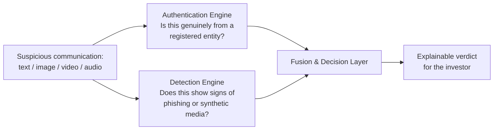

# PRISM — Ideation Phase Pitch Deck Content
### Phishing and Representation Integrity Surveillance for Markets

## Slide 1 — Title

> **PRISM**
> Phishing and Representation Integrity Surveillance for Markets
> A dual-engine approach to synthetic media detection and communication authentication in securities markets
> [Team name] · [Hackathon/track name] · Problem Statement 1

---

## Slide 2 — The Problem

- Generative AI has created a two-sided threat to India's securities markets:
  1. **Synthetic attacks** — deepfake executive videos, cloned voice calls, LLM-written phishing, coordinated social posts
  2. **No authentication layer** — investors have no way to tell a genuine SEBI/exchange/broker communication from a convincing fake
- Retail and first-generation investors on social platforms are the most exposed
- The two gaps compound each other: without a way to verify what's *real*, every convincing fake becomes uncontestable — there's no ground truth to check against
- **Case in point:** BSE Limited issued four separate public advisories within a four-month span in 2026, after a fabricated deepfake video of its own Managing Director & CEO, Sundararaman Ramamurthy, kept resurfacing on WhatsApp and Telegram — falsely offering stock tips and guaranteed returns and funneling victims into private trading groups. Each time, BSE's only recourse was a reactive advisory *after* the video had already spread, because there was no way to cryptographically prove "this is/isn't really BSE" in the first place — precisely the gap this idea targets

**Suggested Visual:** A simple split graphic — attacker-side icons (video/audio/text/social) vs. an authentication-gap icon (a message with a "?" badge). Optionally, a small timeline showing the BSE video resurfacing across months to underline that this isn't a one-off.

---

## Slide 3 — Why Now

- India's capital markets now serve **140M+ unique investors** across **5,900+ listed companies**, growing market cap ~15% CAGR — a rapidly widening attack surface (SEBI Chairman, 38th SEBI Foundation Day, April 2026)
- Finance Minister Sitharaman called cybersecurity/AI-driven threats "the single most pressing challenge facing Indian markets today" at the same event; SEBI launched **Mission Jagrook**, a nationwide investor-awareness drive, in direct response
- SEBI's **May 2026 circular** explicitly advises capital-market participants to adopt advanced AI tooling for vulnerability detection — this is a solution category regulators are actively asking for
- India's **IT Rules Amendment 2026** introduced a mandatory-provenance-metadata requirement for synthetic media — a legal hook that a communication-authentication layer is the natural technical answer to
- Brokers are already fighting this alone and inconsistently: Axis Direct issued its own brand-impersonation advisory as recently as July 2026 — there's no shared market-wide infrastructure yet

---

## Slide 4 — The Idea: A Dual-Engine Approach

> Fight the problem from both sides at once: an **authentication engine** that proves what's genuine, and a **detection engine** that flags what's synthetic — fused into one decision, instead of treated as two separate yes/no checks.

- **Defensive layer:** cryptographically verify communications that really do come from SEBI, an exchange, or a registered broker
- **Offensive layer:** independently score any submitted text, video, or audio for phishing intent and synthetic-media artifacts
- **Fusion layer:** combine both signals (plus lightweight domain intelligence) into a single, explainable verdict — because authenticated ≠ automatically safe, and unauthenticated ≠ automatically malicious

**Suggested Visual (Mermaid — export as an image):**

---

## Slide 5 — Target Users & Channels

| User | Channel | What the idea gives them |
|---|---|---|
| **Retail / first-generation investors** | WhatsApp forwards, social media, direct check via a simple web tool | A plain-language threat verdict with no technical literacy required |
| **Brokers / RIAs / listed companies** | A signing tool for their own official communications | A way to make impersonation instantly falsifiable, rather than reactive PR after the fact |
| **Regulators / market infrastructure (SEBI, exchanges)** | Aggregated visibility into what's circulating and being flagged | Early warning instead of finding out from social media, the way BSE currently does |

---

## Slide 6 — Layer 1: Authenticating What's Genuine

- **Core idea:** Entities sign their official content using asymmetric cryptography. The public keys are stored in a secure zero-trust registry (SQLite via SQLAlchemy).
- **Technical Implementation (Fuzzy Hashing):** A byte-exact hash breaks the moment WhatsApp recompresses a video. To solve this, PRISM uses **TLSH** (Trend Micro Locality Sensitive Hash) for text semantics and **pHash** (Perceptual Hashing) for images/videos. This ensures a compressed forward still verifies correctly.
- **The "dual-lock" refinement for text:** Fuzzy hashing alone is risky, because swapping a single URL barely moves a fuzzy fingerprint. Layer 1 locks critical tokens (links, account numbers) separately and exactly.
- **Three possible outcomes, not a binary:** *Authentic*, *No record found* (handled by Layer 2 AI), and **"Tampering suspected"** (high similarity to something genuine, but a critical detail doesn't match).

**Suggested Visual:** The pen/ink/magnifying-glass analogy as a simple 3-icon graphic, or a genuine-vs-doctored-forward pair showing which single swapped detail breaks verification.

---

## Slide 7 — Layer 2 - Part 1: Detecting Synthetic Text & Phishing Intent

- **Core idea:** General LLMs miss the specific vocabulary of Indian financial fraud (e.g., fake SEBI phishing, WhatsApp pump-and-dump). A model must be grounded in *that* domain.
- **Technical Implementation:** PRISM uses a fine-tuned **FinBERT sequence classifier** built with PyTorch and HuggingFace Transformers, converting financial sentiment analysis into a binary threat detector (`SAFE=0`, `THREAT=1`).
- **Domain Heuristics:** This is paired with a lightweight rules-based check for typo-squatted domains (SEBI/NSE/BSE/Zerodha lookalikes). Because a phishing message and a phishing *link* are two different signals, they are scored independently.
- **Early validation:** The URL-spoofing heuristic alone was stress-tested against 27 realistic attack patterns (typosquats, homoglyphs) and caught every one with zero false alarms.

---

## Slide 8 — Layer 2 - Part 2: Detecting Synthetic Video & Audio

- **Core idea:** Score video and audio *independently*. Real-world attacks often fail in different modalities (e.g., a perfect face-swap paired with a cloned audio track).
- **Video Implementation:** PRISM utilizes a **Multi-Scale Efficient Global Context Vision Transformer (MS-EffGCViT)**, natively processing video streams with internal YOLO face detection via OpenCV. It calculates a `video_fake_score` based on spatiotemporal blending inconsistencies.
- **Audio Implementation:** Uses the **Wav2Vec2-deepfake-voice-detector** transformer model. By analyzing the raw 16kHz audio waveform directly via `librosa`, it remains highly robust against aggressive WhatsApp compression.
- **On-screen Text Extraction:** `Tesseract-OCR` extracts overlaid text from OpenCV frames using Otsu's binarization. This text is routed straight into the Layer 1 FinBERT text detection engine — so a scam script pasted on a video is judged by the same rigorous text model.

---

## Slide 9 — Layer 3: The Central Brain (Fusion & Decision)

- **Core idea:** Authentication and detection aren't separate gates. They are fused alongside a critical metadata signal: **domain age**. Scammers overwhelmingly use domains registered days, not years, ago.
- **Technical Implementation:** A **Random Forest Classifier** (`scikit-learn`) intakes a 5-dimensional feature array: `text_threat_score`, `video_fake_score`, `audio_fake_score`, `domain_age_days` (via dynamic `python-whois` lookups), and `is_authenticated_sender` from Layer 1.
- **Why fusion beats either signal alone:** Imagine a message from a *real, cryptographically verified* broker account, containing manipulative language and a link to a domain registered five days ago. A signature-only system waves this through. Only the Random Forest, seeing *all* signals together, flags this as a genuine account that's been hacked.
- **Explainable Threat Reports:** A bare percentage doesn't help an investor act. The Central Brain feeds the Random Forest's vector output into the **Groq LLM API** to generate a plain-language, real-time explanation reconciling all the signals.

**Suggested Visual:** The "hacked account" scenario as a simple before/after — signature-only verdict vs. fused verdict — to make the fusion argument land visually.

---

## Slide 10 — How It Comes Together

1. Investor encounters a suspicious message, forward, or video
2. It's checked against the authentication engine *and* the detection engine at the same time
3. Any text discovered *inside* media (captions, narration) is looped back through the detection engine as well
4. All signals — authentication status, detection scores, domain age — are combined by the fusion layer
5. The investor receives one verdict and a plain-language explanation, not five separate numbers to interpret themselves

---

## Slide 11 — Early Validation: Why We Believe This Works

- To pressure-test the idea beyond a whiteboard, we've built an early working prototype covering all four concepts above — not a finished product, but proof that the approach is technically feasible and the pieces genuinely fit together
- What that early build has already shown:
  - The authentication concept's fuzzy-hash-plus-signature verification runs end-to-end on real sample documents and survives simulated WhatsApp-style compression
  - The URL-spoofing heuristic catches known Indian financial-brand impersonation patterns reliably (see Concept 2)
  - The fusion logic correctly reproduces the "hacked account" reasoning from Concept 4 on constructed test scenarios
  - A working investor-facing interface exists end-to-end, from submitting a message to receiving a plain-language verdict
- What's still in progress: finishing model tuning on a cleaned, deduplicated training set, and building a larger real-world test set beyond the constructed scenarios above

**Suggested Visual:** One or two clean screenshots of the working interface — enough to show it's real, without turning this into a full product demo.

---

## Slide 12 — Differentiation: Why This Approach

- Most existing tools solve **one** modality (just deepfake video, or just phishing text). This idea scores text, video, audio, *and* domain intelligence, then fuses them — catching cases where no single signal is damning but the combination is
- Most authentication proposals assume the investor will manually track down a signature and public key. This idea's verification is designed to be automatic from the investor's side — they submit content, the system finds the matching record itself
- Purpose-built around **Indian financial-market entities and vernacular fraud patterns**, not a generic global deepfake classifier retrofitted to this market
- Every verdict is designed to come with a **plain-English explanation**, not a bare score — treating explainability as core to investor protection, not a nice-to-have

---

## Slide 13 — Impact & Regulatory Fit

- Directly responsive to SEBI's own May 2026 call for advanced AI tooling in vulnerability detection
- Directly aligned with the IT Rules Amendment 2026's provenance-metadata requirement for synthetic media
- Three concrete adoption paths:
  - **Investors:** a lightweight check surfaced wherever they already are (browser extension, chat-forward, direct web check)
  - **Brokers & RIAs:** the authentication engine doubles as their own compliance-signing tool for official communications
  - **Regulators:** aggregated verdicts become the seed of a market-wide early-warning view — the visibility BSE didn't have during its repeated deepfake incidents

---

## Slide 14 — Vision & Roadmap

- **Near-term:** finish model validation on real-world data, expand the authentication registry to more entity types, broaden the fraud-pattern vocabulary
- **Coordinated-attack detection:** if the same synthetic video is submitted by many investors within a short window, automatically flag it as a viral, coordinated attack for regulators — directly answering the BSE recurrence pattern from Slide 2
- **Frictionless reporting:** meet investors where they already are — e.g., forwarding a suspicious message to a chat-based bot instead of requiring a separate app or portal
- **Explainable-AI visual evidence:** for flagged video, highlight *which* region of the frame drove the synthetic-media flag, so a verdict is visibly justified rather than a black-box number
- **Scalability:** expand the decoupled microservices infrastructure to automatically scale independent components, ensuring that high-load ML inference endpoints can handle sudden nationwide spikes in verification requests

---

## Slide 15 — The Prototype

- **Functional Web Portal:** We have built a working React/Vite frontend where investors can drag-and-drop suspicious assets (videos, audio, text) for real-time analysis.
- **Live AI Inference:** The backend actively runs the MS-EffGCViT (video), Wav2Vec2 (audio), and FinBERT (text) models locally to generate live, independent threat scores.
- **Cryptographic Verification:** The Entity Portal allows authorized users to generate keys and sign mock official releases, successfully demonstrating the zero-trust fuzzy hashing (`pHash`/`TLSH`) logic in Layer 1.
- **Unified Central Brain:** The backend successfully fuses all AI and cryptographic signals, leveraging the Groq LLM API to generate a readable, explainable threat report instantly.

**Suggested Visual:** A screenshot of the PRISM Investor Dashboard showing a live threat analysis report, highlighting the "Safe/Warning/Critical" gauge and the Groq LLM explanation.

---

## Slide 16 — The Tech Stack

- **Frontend:** React 19, TypeScript, Vite, TailwindCSS v4, Recharts
- **Backend Architecture:** Decoupled FastAPI microservices ensuring independent scaling of Cryptography and ML workloads
- **Layer 1 (Authentication):** `cryptography` (Ed25519), `py-tlsh` (Fuzzy Hashing), `imagehash` (Perceptual Hashing), SQLAlchemy + SQLite
- **Layer 2 (AI Inference):** PyTorch, HuggingFace Transformers, OpenCV, Librosa, Tesseract-OCR
  - **Models:** FinBERT (Text), MS-EffGCViT (Video), Wav2Vec2 (Audio)
- **Layer 3 (Central Brain):** `scikit-learn` (Random Forest), `python-whois` (Dynamic Domain Age), Groq LLM API (Explainable AI Reports)

**Suggested Visual:** A clean, multi-layered architecture diagram showing the flow of data from the frontend through the three backend microservices.

---
